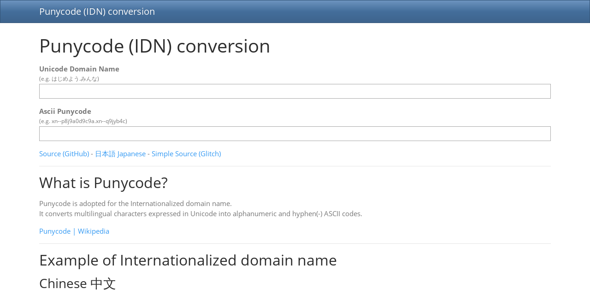

## Punycode (IDN) conversion

It already exists, but most are server-level Punycode conversions.\
This converts Punycode with a web browser using JavaScript + JQuery.\
It is converted in real time as you type. Comfortable! 😁

Live: <https://punycode.net.eu.org/>

___

## Geminispace

You can also use Geminispace! (gemini protocol, no Google AI!)
This is CGI action.

<gemini://g.punycode.net.eu.org/>

