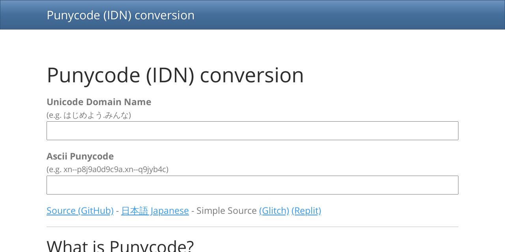

## Punycode (IDN) conversion

It already exists, but most are server-level Punycode conversions.\
This converts Punycode with a web browser using JavaScript + JQuery.\
It is converted in real time as you type. Comfortable! 😁

Live: <https://punycode.net.eu.org/>

Simple Source\
(Glitch): <https://glitch.com/edit/#!/punycode>\
(Replit): <https://replit.com/@balloonvendor/punycode>
